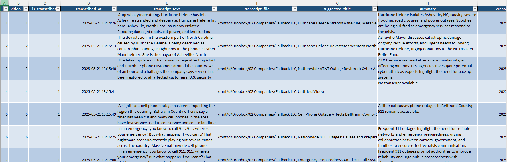
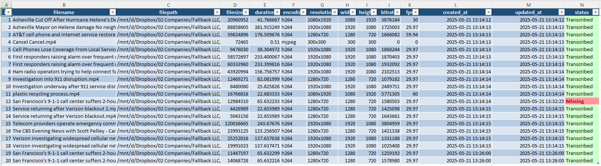
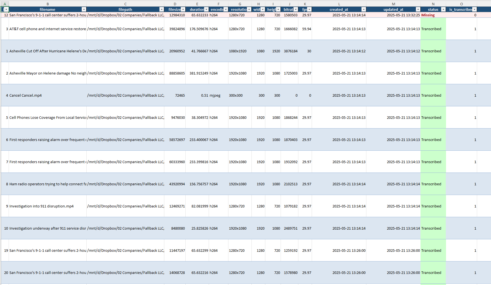
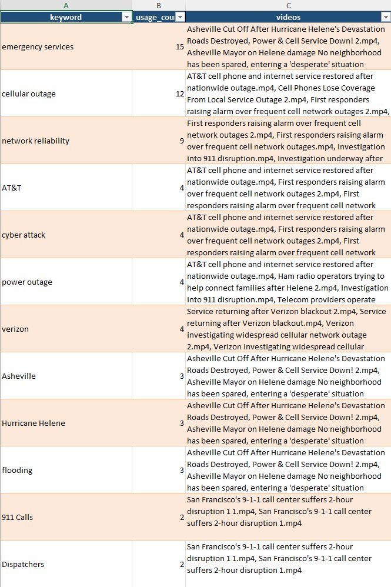

# Video Library Transcription & Management System

A comprehensive Python application for transcribing, summarizing, and organizing video files using OpenAI Whisper and GPT-4o with SQLite storage.


## Overview

Video Library Transcription & Management System is a comprehensive solution that transforms your video collection into a fully searchable, well-organized media database with AI-powered insights.

The application leverages several advanced AI technologies to process your videos:

- **OpenAI Whisper** provides state-of-the-art speech recognition to accurately transcribe audio from videos in multiple languages
- **GPT-4o** analyzes the transcripts to generate meaningful titles that capture the essence of each video
- **AI-Powered Summarization** creates concise summaries of video content, making it easy to understand the main points without watching the entire video
- **Intelligent Keyword Generation** extracts relevant topics and concepts while maintaining a controlled vocabulary by checking for existing keywords before creating new ones
- **Special Entity Preservation** ensures company names and abbreviations maintain proper casing (like AT&T, T-Mobile, IBM)

The entire process is automated — simply point the application at your video folder, and it will:

1. Scan for new video files and extract metadata (resolution, duration, codec)
2. Transcribe the audio using OpenAI's Whisper model
3. Generate titles, summaries, and keywords using GPT-4o
4. Create formatted markdown transcripts for easy reading
5. Store everything in a SQLite database with proper relationships
6. Export organized Excel reports with color-coding and filtering capabilities

This enables you to quickly search, filter, and discover content across your entire video collection without manually watching hours of footage.

## Features

- **Video Processing**
  - Automatically scan folders for video files
  - Extract video metadata (resolution, bitrate, encoding, duration, etc.)
  - Track file status (New, Transcribed, Missing, Error Transcribing)
  - Detect missing videos and update their status

- **Transcription**
  - Transcribe videos using OpenAI Whisper
  - Generate intelligent titles and summaries using OpenAI GPT-4o
  - Create keyword tags for content categorization
  - Preserve special casing for company names (AT&T, T-Mobile, etc.)
  - Create formatted markdown transcript files

- **Database**
  - Store all information in SQLite database
  - Support for many-to-many relationships between transcriptions and keywords
  - Automatic database migrations
  - Export to formatted Excel reports

- **Excel Reports**
  - Multi-sheet formatted exports with tables and filtering
  - Color-coding for video status
  - Join view with all related data
  - Keywords usage statistics
  - Word-wrapping for long text with reasonable height limits

## Screenshots

### Excel Report - Main View

*The main Videos with Transcripts view showing video metadata, transcription details, and associated keywords*

### Excel Report - Keywords Usage

*Keywords usage statistics showing frequency and associated videos*

### Excel Report - Info Sheet

*Documentation sheet with field descriptions and usage tips*

### Markdown Transcript

*Example of a generated markdown transcript with video metadata, summary, and keywords*

## Requirements

- Python 3.8+
- FFmpeg installed on your system
- CUDA-compatible GPU (optional, for faster transcription)

## Installation

1. Clone this repository:
   ```
   git clone https://github.com/tirandagan/whisper-media-catalog.git
   cd whisper-media-catalog
   ```

2. Install dependencies:
   ```
   pip install -r requirements.txt
   ```

3. Install FFmpeg:
   - Ubuntu/Debian: `sudo apt install ffmpeg`
   - macOS: `brew install ffmpeg`
   - Windows: [Download from FFmpeg website](https://www.ffmpeg.org/download.html)

## Configuration

Create or edit the config.ini file:

```ini
[secrets]
openai_api_key = your_openai_api_key_here

[folders]
input = /path/to/your/videos/
database = /path/to/your/database/
transcripts = /path/to/your/transcripts/

[database]
filename = vlts_database.db

[whisper]
model_size = base
language = en
```

You can also set the OpenAI API key using an environment variable:
```
export OPENAI_API_KEY=your_api_key_here
```

## Quick Start

```bash
# Clone the repository
git clone https://github.com/tirandagan/whisper-media-catalog.git
cd whisper-media-catalog

# Install dependencies
pip install -r requirements.txt

# Edit config.ini with your OpenAI API key and folders
# Then run the Video Library Transcription & Management System
python main.py --verbose
```

## Usage

1. Make sure the input, database, and transcripts folders in your config.ini exist.

2. Run the application:
   ```
   python main.py
   ```

### Command Line Options

- `--config` or `-c`: Specify a custom config file path
  ```
  python main.py --config /path/to/custom_config.ini
  ```

- `--scan-only`: Only scan for videos and extract metadata, skip transcription
  ```
  python main.py --scan-only
  ```

- `--transcribe-only`: Only transcribe videos that have been scanned but not transcribed
  ```
  python main.py --transcribe-only
  ```

- `--single_file`: Process only one new file and then exit
  ```
  python main.py --single_file
  ```

- `--no-excel`: Skip exporting database to Excel at the end
  ```
  python main.py --no-excel
  ```

- `--verbose` or `-v`: Enable verbose output (INFO-level logging)
  ```
  python main.py --verbose
  ```

## Database Schema

The Video Library Transcription & Management System uses a SQLite database with the following structure:

- `videos`: Stores video file information and technical metadata
  - Tracks file status (New, Transcribed, Missing, Error Transcribing)
  - Contains technical metadata like resolution, encoding, duration

- `transcriptions`: Stores transcription data
  - Full text transcription
  - AI-generated title and summary
  - Path to markdown transcript file

- `keywords`: Reusable content keywords
  - Unique keywords with proper casing rules
  - Used for categorizing content topics

- `transcription_keywords`: Association table for the many-to-many relationship

## Output Files

### Markdown Transcripts

For each transcribed video, a markdown file is created with:
- Title and summary
- File information (duration, resolution, etc.)
- Keywords
- Full transcript text

### Excel Reports

An Excel workbook with multiple sheets is generated:
- Info: Field descriptions and usage tips
- Videos_With_Transcripts: Main view with joined data
- Keywords_Usage: Keyword frequency statistics
- Raw data tables for each database table

## Migration

To update an existing database to the latest schema:

```
python migrate_database.py
```

This ensures all tables and columns are properly created or updated for the Video Library Transcription & Management System.

## License

MIT